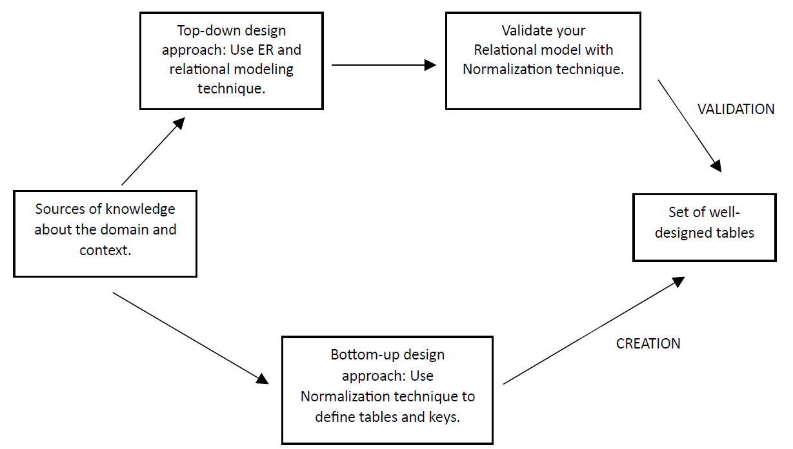
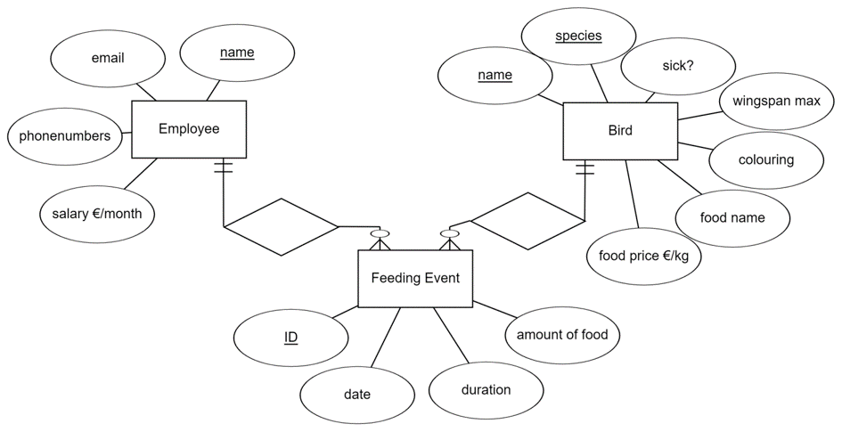
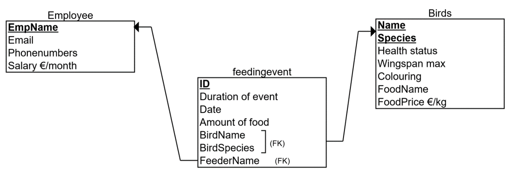
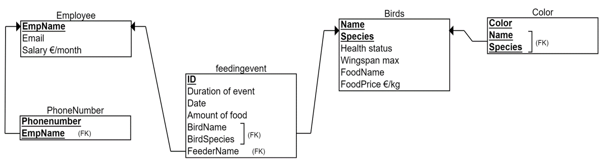
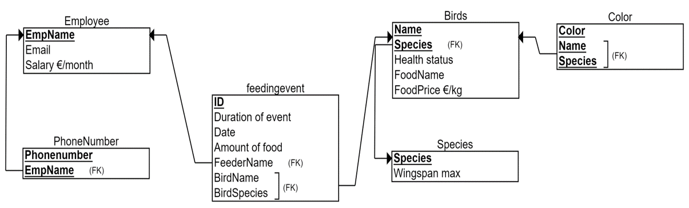
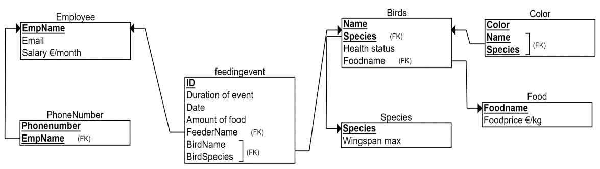
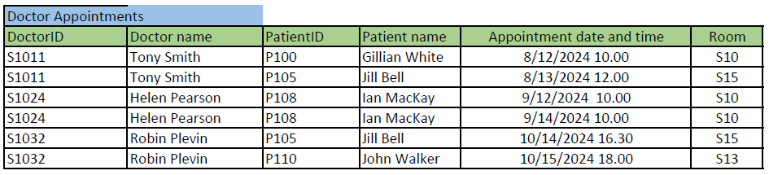
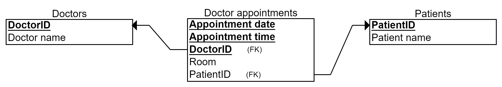

# Goals and content

In this tutorial, you will learn how to use normalization to validate your relational schema before the actual implementation.

- What is normalization and when could you use it?
- 1st, 2nd and 3rd normal forms
- Process of normalization
- Examples

# What is normalization and when could you use it?

Normalization is the process of splitting tables (relations) into well-structured tables (relations). Well-structured or well-designed means here that it allows users to insert, delete, and update rows (tuples) without introducing database inconsistencies and anomalies i.e., the problems we discussed in the previous tutorial.

Normalization can be used in two ways: To create relations or to validate relations. In the previous tutorials, we have learnt how to plan database structure with ER and relational model. Now it is time to check our plans based on the normalization process. Normalization is then used as a validation technique, which is described in the upper task flow in the image below. The other option is to collect all data-related requirements but not to model with ER or relational model and use normalization process to create meaningful tables. This approach could be named as a bottom-up approach, which is described in the lower task flow in the image below. We highly recommend using normalization for validation purposes although we practice both approaches in this tutorial. As a validation technique, normalization complements ER modeling and helps us to spot, once again, possible weaknesses and errors in our database design. However, well-designed and thought relational model is usually correct in terms of normalization rules. Those rules, or normal forms, are discussed next.

# Process of normalization

## Dependencies of attributes in focus

In normalization, we concentrate on *dependencies between attributes*. There is a dependency when one attribute unequivocally and always defines the value of another attribute.

For example, in an imaginary Student-table, the StudentID-attribute defines the value of the student’s Name-attribute. In other words, if you know the value of StudentID (let’s say number 12345), you will always find a certain value in the Name attribute (let’s say ‘Michael’ for that StudentID value). We can mark it like this:

StudentID à Name

There is no dependency to the other way. The Name does not define the StudentID. For example, if you know the value of Name (let’s say ‘Michael’), you will not always find a certain value in StudentID as there are many students with the same name and they have different StudentIDs.

In normalization, we look at these dependencies and try to find the ones that might cause troubles. In the example above, the same StudentID does not lead you to two or more different names and it shouldn’t (12345 leads only to Michael). So, this *dependency is fine*, only if we have recognized the StudentID-attribute as 1) a primary key or 2) a minimal superkey (= a candidate key) having the characteristics of prime attribute (i.e. due to its uniqueness it could be a primary key of this relation although it was not selected by the designer). This *dependency is problematic,* if we do not handle it, and for example, allow inserting students with same StudentIDs. The normalization puts our focus on problematic dependencies, suggests solutions how to handle these dependencies either by splitting the attributes and tables (well-designed relations), adding rules to the database management system or to the upper software layer and user interface.

## Normal forms as rules

Normalization has rules for checking the dependencies and properties of a table that are called *normal forms*. In normalization, we will review each table (relation) separately and check in which *normal form* it is*.* There are several normal forms. The most practical normal forms are the first, second and third normal form (1NF, 2NF and 3NF). The rest of the normal forms (BCNF, 4NF, 5NF) apply to situations that are quite rare in practice. There are exact mathematical definitions for each normal form, yet we use simpler versions here. We define the normal forms (i.e. rules) in the following way:

**1NF**: This consists of three rules:

**a)** The table must have a primary key (i.e. which unequivocally *defines* values of other attributes)

**b)** Each column of the table should contain only single values (i.e. no multiple values in one cell)

**c)** The table should not have duplicates in columns (i.e. two columns with the same meaning, storing same data)

**2NF:** Rule: Normal columns should not depend only on *part of* primary key (or candidate key). Some explanation below

- This rule *applies only to tables that have more than one primary key column*. ‘Part of’ means that the primary key is a combination of columns and ‘depend only on part of’ means that we do not need to know values of all primary key columns to know the value of the normal column. In tables with only one primary key column, a column is fully dependent on the primary key.
- This rule *applies only to normal columns’ dependencies with primary key columns*. ‘Normal columns’ mean other columns than columns that belong to primary or candidate key.
**3NF:** Rule: Normal column should not depend on another normal column.

- This rule checks dependencies between normal columns. This rule does not check primary or candidate keys.
## Process of normalization

Normalization reviews each (relational) table separately whether it breaks the normal form rules or not.

First, we check does the table meet the rule of 1NF. If it does not, we make changes to the table or its attributes. When the table meets the rule of 1NF, we move to check does the table meet the rule of 2NF, and so forth. We must check it in the order of 1NF, 2NF, 3NF. Changes to tables do not add or remove any information (e.g. create new data to be stored by the database) but are rather splitting operations to attributes and tables.

In order to review whether the table meets certain rule, we need to have a good knowledge about the real-world context and we need to understand well what the meaning and purpose of the column and its data content is. A well-designed ER model is already in third normal form (3NF), which is usually enough. (This is also why we stop here and do not concentrate on other normal forms).

# Example of normalization in validation purpose

Remember the Zoo example? Let’s imagine that our initial ER model would have been a bit different than in previous examples. Now, our solution represented as an ER model would look like this.

In the above ER model, we have attached the favorite food of the bird and its price to Bird-entity. We also want to store data about the bird’s colors and maximum wingspan that denotes the size of the bird (e.g. Pelicans have larger wingspan than Colibris). Another change is that for employees we would like to store their home and work phone numbers. The ER model seems fine, and we have converted it to a relational model shown below.

**1NF:**

First, we check 1NF rule for each table. The rule says that there must be a) primary keys, b) only single values and c) no repetition in columns.

In the Employee-table, there is a primary key EmpName, which defines all other attributes (a). This is fine, accepting the limitation that we cannot store employees with the same name into the database. In the Employee-table there are no columns that have the same meaning (c). For example, Email address is not repeated in any other column. Attributes EmpName, Email and Salary are single-valued (b). For example, we have an employee named Michael, with email address michael@zoo.com and salary 2000 €. There are no two names, two emails or two salaries for one row in the employee table. However, Phonenumbers-column is aimed at holding many values for one person (for example, for Michael the home phone 012-111111 and work phone 045-222222). This column breaks the rule of 1NF (point b) and we need to fix it. We have the following options:

Solution types to multi-valued columns:

1. Add the rule breaking column to the primary key.
1. Add fixed number of columns (as many as there are possible values).
1. Add new table.
In the above Zoo case, it is not meaningful to use option 1 due to unnecessary repetition of employee data. In that option, we would have a primary key (EmpName, Phonenumber) meaning that for each employee we would have as many rows as they have different phone numbers. For example, for Michael, we would repeat his name, email address and salary in two rows, the other containing the home phone and the other the work phone number. Remember, one of the design aims is to save the storage capacity required by the database.

The option 2 would be suitable if we know that storing two phone numbers (home/work) is enough in real-world (Zoo’s daily practices). Option 2 means that we would split the Phonenumbers-column in two: Home phone and Work phone columns. For example, for Michael, we would store one row with data like (Michael, michael@zoo.com, 2000 €, 012-111111, 045-222222). Now, like in option 1, all columns would be single-valued. If there is any doubt that in the future, the Zoo would like to store third phone number for an employee, do not implement the option 2. Moreover, if there is a chance that most of the employees have only one phone number, the other column would contain a lot of NULL values. Again, to save disk space, and to avoid sometimes problematic NULL values, we would not implement the option 2 either.

The option 3 is similar than the solution, if we would have already modelled the Phonenumber-attribute as multivalued (double-line attribute) and done the ER to relational model converting based on that. In this option, we split the employee-table in two: Employee and Phonenumber. We move the rule-breaking attribute of Phonenumber to the Phonenumber-table and add an attribute (foreign key) referencing to the Employee-table. Now, all the columns in the Employee table are single-valued as are the columns in the Phonenumber-table. For example, for Michael, Phonenumbers-table contains two rows (Michael, 012-111111) and (Michael, 045-222222). We choose to use this option 3 to solve 1NF rule for Employee-table.

FeedingEvent-table meets the 1NF rule.

Bird-table is otherwise meeting the 1NF rule, but it has the column Coloring, which refers to multiple colors of a one bird. For example, Donald Duck (name, species) coloring is white, blue and yellow that denote three values in the same cell. We use the same option 3 to solve this 1NF rule-breaking column and create a new table called Color. This option is especially good here, because the number of colors vary a lot between birds, unlike the number of phone numbers between the employees, and implementing a correct number of columns (option 2) for storing colors is impossible.

You may have noticed that evaluating the single-valued rule of 1NF is not always exact. In the above example, we could have claimed that EmpName holds at least two values: First name and Last name. Yes, it does, and we could have split this column in two as well. Similarly, email address contains two parts (username and domain name), any date-column contains days, months and years, et cetera. These introduce possible columns to be split. However, we must use our knowledge about the domain and implementation context (here: Zoo and their needs and daily practices), to decide which columns require is better to split or not (to avoid insert, update and deletion problems later when doing these operations in the Zoo context).

The resulting relational model, which is in the first normal form (1NF) is shown below.

**2NF:**

We continue the normalization from the above set of tables.

2NF rule says that normal columns should not depend only on *part of* primary key. The rule concerns only tables with two or more primary key columns. In the above relational model, there are three tables which have a composite primary key: Phonenumber, Bird and Color tables. In the Phonenumber and Color tables there are no normal columns, only prime attributes, so 2NF does not concern these tables. Let’s look at the normal columns of the Bird-table next.

Health status column holds the information about whether the bird is sick or not. Now we ask ourselves: Is this health status dependent only on bird’s name or species alone? If we know the bird’s name (let’s say Donald), do we always know what is the health status (sick / not sick)? No, we don’t. We can have Donald Duck and Donald Pelican, which have different health status, so to define health status we need to know not only the name of the bird (Donald) but also the species (Duck or Pelican). Health status -column is then not dependent only on the Name column. Health status -column is not dependent only on the Species column either, because some Ducks can be sick and some not. This way we walk through each normal column checking dependencies on either Name or Species.

Foodname -column refers to the favorite food of the bird. In this case, let’s imagine that we know that this is bird-specific meaning that even the birds with same species can have different favorites in foods. For example, Donald Duck likes potatoes and Lisa Duck likes carrots. Foodname is then not partially dependent on the primary key. Using the same reasoning, we conclude that Foodprice is not dependent on Species or Name alone. However, Wingspan_max -column stores data about what is the maximum size of the bird, and due our comprehensive knowledge of the domain, we conclude that this is same value for all birds in the same species. For example, for all ducks it holds 1.5 meters and for all pelicans 2.9 meters. Therefore we can conclude that Wingspan_max depends only on Species (Species à Wingspan_max), which breaks the 2NF rule.

The solution is to cut out the rule-breaking column (Wingspan_max) and add it to its own table with the column it is fully dependent of (Species). Thus, we will create a new table called Species, add both columns into it, and define Species as the primary key. This new table does not break the 2NF rule as it now has only one primary key column (and it does not break the 1NF if there is a primary key, single values and no repetition). The resulting relational model which is in 2NF is shown below. Note, that while we deleted the Wingspan_max column from the original Bird-table, we had to keep Species -column as other normal columns are fully dependent on the whole primary key (Name, Species). Moreover, this Species-column became a foreign key referring to the new Species-table and its Species-column as the primary key. In other words, we collect all the species-specific data into Species-table, for example their distribution and habitat, and the direction of the reference is from Bird to Species.

**3NF:**

We continue the normalization from the above set of tables.

3NF rule says that normal columns should not depend on each other. In the above relational model, there are three tables which can have more than one normal column and thus can even have dependencies between them: Employee, Bird and Feedingevent.

In the Feedingevent-table, we look at all combinations of dependencies between Duration of event, Date and Amount of food. So, we check whether there are dependencies like

- Date à Amount of food: No, feeding events taking place at the same date does not have to have the same amount of food given.
- Duration of event à Amount of food: No, although there could be a correlation but no determination. For example, in 15 minutes we could throw 2 kilograms of potatoes, but carrots we throw only 1 1/2 kilograms in the same 15 minutes.
In the same way we check all the possible combinations of dependencies between normal columns. We conclude that there are no dependencies between normal columns in this table.

In the employee table, there are two possible dependencies: Email à Salary and Salary à Email. We ask, if we know the salary (2000€) does it lead us always to a certain e-mail address? No, it does not unless we have unique salaries for employees. And even we had unique salaries at the moment, it doesn't guarantee that We could have same salaries in the future. Next we ask to the e-mail address define the salary. For example if we know that the e-mail address is michael@zoo.com, does it lead us to a certain salary? Of course the e-mail address does not determine the salary, but yes, there is a dependency: A certain e-mail address defines unequivocally the salary. For example, 4 michael@zoo.com the salary is 2000 euros Not 2000 500 or 400. This is because the e-mail address is unique. It means that the e-mail address column is a candidate key that could have been chosen for the primary key of the employee table. Third normal form does not concentrate on prime attributes, therefore the dependency is fine and we do not do any changes.

In the bird table we look at dependencies like whether the food name defines the health status of the bird. Again, there could be a correlation that if you like fast food the more likely you get sick. However there is no dependency between these two. For example, all the birds who like carrots are not sick. The dependency between food name and food price is more clear. We assume here that the food name defines the food price. For example, carrots cost 7€ per kilogram and potatoes 3€ per kilogram that is always the same for the all birds who like carrots or potatoes. Thus, Foodname à Foodprice dependency breaks the rule of third normal form.

The solution is the same than with 2NF. We create a new table called Food, where we put both of the columns and delete Foodprice as the rule-breaking column from the Bird-table. The resulting relational model, which is in 3NF is shown below. As said earlier, we could have ended in similar solution with careful ER modeling, in which defining multivalued attributes and recognizing concepts like Food and Species as entities would have resulted a similar relational model. Now we have successfully used normalization to validate our initial design. This is our final relational model, which we will implement with SQL.

# Example of normalization in creational purpose

In this approach, we use normalization to create our initial design.

Imagine that you are designing a database for a health care center to keep track their doctors’ appointments with patients. You have collected requirements and all data columns that the database requires to store in the future: The database should store patient’s name and ID, doctor’s name and ID, and when and in which room the appointment is.

You have presented these requirements in the table format (see the image below). (This table not drawn as a relational model but with the Excel to get to show the data content.) Note, that the actual data content is added just as an example about the kind of data (type) each column could store in real database (e.g. Tony Smith to the Doctor name -column). The normalization is still based on the dependencies between the columns and no individual data example influence on that.

Next, we normalize the above table step by step to 3rd normal form. The objective is to get a well-designed set of tables i.e. the relational model, which we can implement. We represent the result of each phase (1NF, 2NF, 3NF) together with primary (bolded, underlined) and foreign keys (FK).

**1NF:**

The rule says, a table must have a) a primary key, b) no multivalued and c) repetitive columns.

**a)** First, we define the primary key, which is sometimes the most difficult and affective decision for the normalization result. We can define a proper primary key by adding or subtracting columns one by one from the imaginary primary key. In subtracting, first consider all the columns (superkey) belonging to the primary key  and then removing as many as you can (a minimal superkey) without losing the required details. In this example, we do the opposite, and add columns one by one. We ask, what defines one doctor appointment? Let’s select DoctorID first. Is it enough for the primary key, which should separate each row in the table? No, a doctor can have several appointments, so the same DoctorID appears many times in this table (as you can see in the example data e.g. S1011). We need to add another column to the primary key (or start over from another column).  Adding Doctor name does not make a difference. Next, we add PatientID, so that the primary key would be (DoctorID, PatientID). Now, we must think what does it mean in real-life (for the health care center’s practice)? A doctor can have many appointments but cannot meet the same patient twice. That is better, but not good enough as patients favor visiting the same doctor. Let’s add Appointment date and time -column to the primary key, so that the primary key would be (DoctorID, PatientID, Appointment date and time). What does it mean? A doctor can have an appointment with the same patient, if the appointment takes place at different appointment data and time. That sounds good. This primary key allows also some special cases: For example, one doctor meeting two or more patients at the same time (group appointment), and two or more doctors meeting one patient at the same time (multi-professional care). If both types of appointments are required by the database, this is our minimal superkey and selected as the primary key.

Note, that our domain knowledge and collected requirements highly effect in searching the minimal superkey (as it would when designing the ER model in top-down approach). If the above-mentioned special cases (multi-professional care or group appointments) are not needed, we must note that we can drop either DoctorID or PatientID, in order the super key to be minimal. So, we have two possible minimal super keys i.e. candidate keys (PatientID, Appointment date, Appointment time) and (DoctorID, Appointment date, Appointment time). Both allow doctors and patients meet if it happens at different times. We have selected the latter as the primary key for this example.

**b) and c)** You might have noticed that we already found one multi-valued column and split Appointment date and time to two different columns for the primary key. Names could be split too as discussed before. Repetition of columns is not found.

Now the table is in 1NF and shown below.

**2NF:**

We continue normalization from the table above.

The 2NF rule says, that normal columns should not depend only on *part of* primary key.

There are 4 normal columns in the table: Doctor name, PatientID, Patient name and Room.

We check if there are dependencies like

- DoctorID à Doctor name: Yes, doctor can have only one name.
- DoctorID à PatientID: No, a doctor can have many patients.
- DoctorID à Patient name: No, a doctor can have many patients.
- DoctorID à Room: No, a doctor can work in many rooms.
- (DoctorID, Appointment Date) à No, doctor can work in many rooms on the same day.
and check all other combinations where Prime column(s) à Normal column. No other dependencies are found.

To solve the rule-breaking dependency DoctorID à Doctor name, we create a new table Doctors and connect it with the foreign key DoctorID.

Now both tables are in 2NF and shown below.

**3NF:**

We continue normalization from the 2NF tables above.

3NF rule says that normal columns should not depend on each other.

In Doctors table, there are no 2 or more normal columns. In Doctor appointments table, there are 3 normal columns: PatientID, Patient name and Room. Checking the dependencies between them result in the dependency PatientID à Patient name. Fixing the situation requires us to take the rule-breaking column out of the original table to its own Patients-table and creating a foreign key like previously.

Now all tables are in 3NF and shown below. The corresponding relational model representation is shown also below. We can end here the normalization and implement the tables with SQL. Note, that in this case, despite our selection of primary key, we would have ended up into same set of tables (i.e. same changes made at different phases of normalization).

