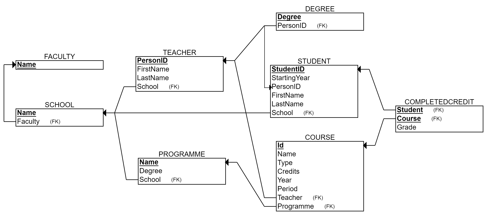
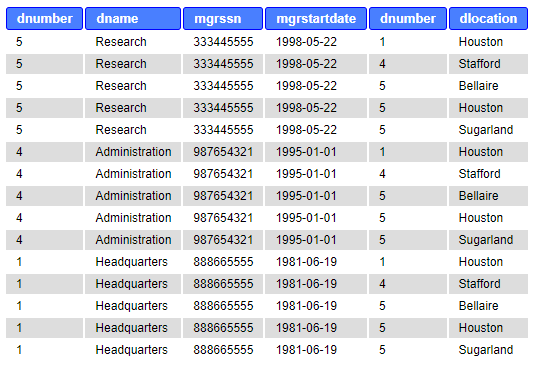

## Content and goals

In this last tutorial of the course, more advanced SQL statements are covered.

Now that you have familiarized yourself with the basics of SQL queries, you can compare them to the ER and relational model. While ER and relational models give an overall picture, With SQL statements, only a part of the entire database is processed at a time. SQL statements are the other end of the continuum, where modeling has moved from reality to technical implementation. With each step, one moves to a lower level of abstraction, where the versatility of reality is replaced by a detailed, small-area and more technical description.

This tutorial examines the uses of SQL statements:

- Aggregate functions MIN, MAX, AVG, SUM, and COUNT
- Combining tables with different JOIN types
- Getting sub-totals by grouping with GROUP BY and restricting groups with HAVING
- Using subqueries
- EXISTS and NOT EXISTS
Our database management system in Ville is called SQLite. It is much used all over the world, and you can find more information about its specification here: [https://www.sqlite.org/](https://www.sqlite.org/). Very informative tutorial to SQLite specific commands is here: [https://www.sqlitetutorial.net/](https://www.sqlitetutorial.net/). However, we try to use as much standard SQL as possible. Very good source for more standard SQL commands (although with MySQL, Microsoft and Oracle emphasis) is here: [https://www.w3schools.com/sql/default.asp](https://www.w3schools.com/sql/default.asp)

# Databases in use

## Database in examples

**The database used in the tutorial examples** is called a Company database. It is already familiar to you from the previous exercises and examples, however minor changes can exist.

The final relational schema with the implemented table and column names is represented in the picture below. You can always come back and check this representation of the Company, yet we recommend you to **download the picture** to your local computer, in order to keep it easily avalaible.

The number one rule and a prerequisite in creating queries with SQL is to "**know your database**". Therefore, knowing column names, table connections etc. helps you understanding how the query language works.  

The relational model of a Company database used in the SQL examples

*Description of the Company database:*

*The Company database holds data about organization’s employees, departments, and projects. Each employee works in one department. Each department has an employee as a manager (mgrssn). Employees have supervisors (superssn) that are other employees. Each department can have several locations. The Company has projects, which are managed by departments. Each employee can work in many projects. Each employee can have several dependents (e.g. a spouse and a daughter).*

## Database in exercises

Our database in the exercises of this tutorial is called CourseDB. (We need more complex database than MovieDB to practice more advanced SQL queries).

CourseDB is somewhat familiar to you from the previous tutorials. The database stores data about University context, such as courses, students, teachers and organizational units (schools and faculties in the university).

You can download the image of the relational model on your local computer, although the model is provided in exercises as well. In any exercise exploiting the CourseDB, you can execute basic SQL queries (such as SELECT * FROM table) to familiarize yourself with the data content, data types and formats. The textual representation of the database structure is presented below as well.

*Description:*

*University consists of faculties (such as Faculty of Technology), which consist of schools (such as School of Computing and School of Culture&Arts). Schools manage stydy programmes that arrange courses. Courses are taught by teachers and completed by students with certain grade. Teachers and students are working and accepted to study in specific school. Both have also one or more educational degrees. (Note, that the column degree in Programme-table does not refer to Degree-table).*

**COURSE**(Id TEXT PRIMARY KEY NOT NULL, Name TEXT, Type TEXT, Credits INT, Period INT, Year INT, Programme TEXT [fk], Teacher TEXT [fk])
**SCHOOL**(Name TEXT PRIMARY KEY NOT NULL, Faculty TEXT [fk])
**FACULTY**(Name TEXT PRIMARY KEY NOT NULL)
**TEACHER**(PersonID TEXT PRIMARY KEY NOT NULL, FirstName TEXT, LastName TEXT, School TEXT [fk])
**STUDENT**(StudentID INT PRIMARY KEY NOT NULL, PersonID TEXT, FirstName TEXT, LastName TEXT, School TEXT [fk], StartingYear INT)
**PROGRAMME**(Name TEXT PRIMARY KEY NOT NULL, Degree TEXT, School TEXT [fk])
**COMPLETEDCREDIT**(Course TEXT PRIMARY KEY NOT NULL [fk], Student INT PRIMARY KEY NOT NULL [fk], Grade INT)
**DEGREE**(PersonID TEXT PRIMARY KEY NOT NULL [fk], Degree TEXT PRIMARY KEY NOT NULL)

CourseDB is used in the exercises of the tutorial.

## Aggregate functions

Aggregate functions
There are several aggregate functions available in SQL:

- AVG
- COUNT
- MAX
- MIN
- SUM
Aggregate functions can be used in a SELECT statement.

**These functions return only one value** (per group of data). It means that the resulting table has only one row (see examples below).

**Example**: **Calculate the total sum of salaries of our employees.**

SELECT SUM(Salary)
FROM Employee;

Answer: 281000.0

**Example**: **Calculate the total sum of salaries of the department number 4 employees, if we had raised them 10%. Round the result to two decimals.**

SELECT ROUND(SUM(e.salary)*1.1) AS new_sum_of_salaries
FROM Employee e
WHERE e.dno = 4;

The result looks like:

Above, ROUND() is a function used to round the decimals. It is not one of the aggregate functions in SQL standard. Mathematical operations can be used with aggragate functions.

**Example**: **How many different salaries our employees have?**

SELECT COUNT(DISTINCT Salary)
FROM Employee;

If the DISTINCT were left out, it would be calculated how many employees will be paid (NULL values in the salary column would be ignored, however). Now only different salaries are taken into account.

Aggregate functions are needed in addition to generating aggregate data, but also in queries whose selection criteria contain conditions based on number.

## JOIN

This far, we have joined two or more tables together in the FROM-part by separating the tables with comma and providing the joining condition in the WHERE-part.

For example, for joining employees with their corresponding deparment, we have used syntax like

SELECT  e.lname, d.dname
FROM Employee e, Department d
WHERE e.dno = d.dnumber;

The weakness of this syntax above is that there are many conditions in the WHERE part in more complex queries joining many tables. These joining conditions get mixed up with other conditions (like string search conditions) and the query loses its clarity. In this situation, there is also a chance to forgot one or more important table joining conditions (and the query ends up in performing the cartesian product). Moreover, the above syntax is not best in terms of computing performance: First, the FROM part performs the cartesian product, and second, the WHERE part removes wrong tuples. DBMSs do not optimize this performance.

**JOIN or INNER JOIN**

Another way to merge tables is to use the reserved word JOIN or INNER JOIN (some DBMSs may require using the official wording). JOIN is used in the FROM-clause between two tables, after which we write the reserved word ON and the joining condition. So, joining is based on the condition given after the word ON.  **JOIN produces only the set of records that match in both Table A and Table B.**

**General format:**

FROM TableName1 JOIN TableName2 ON tablename1.column1 = tablename2.column2

Below is a Venn diagram, describing the result of JOIN between tables A and B.

Usually, in relational databases, we join tables based on their connections through foreign and primary keys, so we can present the format as follows:

FROM TableName1 JOIN TableName2 ON tablename1.foreignkey = tablename2.primarykey

For example, the same query than above with the JOIN

**Example: List employees (lname) with their corresponding deparment (dname).**

SELECT e.lname, d.dname
FROM employee e JOIN Department d ON e.dno = d.dnumber;

Note, that above the WHERE-clause is unnecessary (and is free for other conditions) and correct tuples and tables are formed already in the FROM-part.

Let’s take a look at the joined table more closely.

**Example: List employees (ssn, fname, lname, dno) with their corresponding deparment (dnumber, dname, mgrssn, mgrstartdate).**

SELECT  ssn, fname, lname, dno, dnumber, dname, mgrssn, mgrstartdate
FROM employee e JOIN Department d ON e.dno = d.dnumber;

**In case three or more tables need joining**, we continue with the word JOIN, like this

FROM Table 1 JOIN Table 2 ON table1.foreignkey = table2.primarykey JOIN Table 3 ON table2.foreignkey = table3.primarykey

- The order of columns in the ON part is not set. You can put them any way.
- The dot notation is not necessary if the column names are unique.
- The order of tables is not set either, but it may have an effect on certain types of JOINs and in the result table
	
		For example, in the above example, you could join first Table 2 with Table 3 and then their combination with the Table 1. 
		Of course, semantically the tables must have a meaningful connection: For example, if tables 1 and 3 do not have any connection, you cannot skip joining the table 2, and must first join the table 2 either with 1 or 3.
**Example**: List employees (lname) and the projects (pname) they work in.

SELECT e.lname, p.pname
FROM employee e JOIN works_on d ON e.ssn = d.essn JOIN project p ON d.pno=p.pnumber;

**Example**: List employees (lname) and their working hours (hours) in the project named "ProductX".

SELECT e.lname, d.hours
FROM employee e JOIN works_on d ON e.ssn = d.essn JOIN project p ON d.pno=p.pnumber
WHERE p.pname LIKE "ProductX";

## Other JOIN types

**Other types of JOIN:**

NATURAL JOIN
FULL JOIN
LEFT JOIN
RIGHT JOIN

Official terms FULL OUTER JOIN, LEFT / RIGHT OUTER JOIN, but the word OUTER is not needed in most DBMSs.

**NATURAL JOIN**

Requires that matching columns (joining condition) are with the same name. Department and Dept_locations both have Dnumber. Dnumber is only once in the result table. The result is similar to INNER JOIN and JOIN except there are no duplicate columns in the result table.

**Example**:

SELECT *
FROM department NATURAL JOIN dept_locations;
  

**FULL JOIN**

Returns all rows from both tables, matching or not. If not matching, showing NULL. SQLite do not support FULL OUTER JOIN. However, using both LEFT and/or RIGHT JOINS and combining two result sets with the word UNION, you can achieve FULL JOIN in SQLite.
  

**Example:**

SELECT ssn, fname, lname, dno, dnumber, dname
FROM employee FULL JOIN department ON dno=dnumber

**Example (in SQLite):**

SELECT ssn, fname, lname, dno, dnumber, dname
FROM employee LEFT JOIN department ON dno=dnumber

UNION

SELECT ssn, fname, lname, dno, dnumber, dname
FROM department LEFT JOIN employee ON dno=dnumber;

The result table below is imaginary (fake) for example purposes. The Company database does not allow inserting an employee without a department (Dno NOT NULL definition in Employee-table DDL sentences.)  

  

**CROSS JOIN**

Basically the Cartesian product. Another name is CARTESIAN JOIN. Hard to find any uses, because produces wrong tuples.
Very expensive in terms of computing resources. Same result as when naming tables in the FROM clause without a joining condition in the WHERE clause.

**Example:**

SELECT *
FROM department CROSS JOIN dept_locations;  

  

**LEFT JOIN or RIGHT JOIN**

Returns all rows from the table on the left and matching rows from the table on the right. In the example below, results all employees (the table is on the left from the words LEFT JOIN) and matches in the dependent table. If not matching, shows NULL in the right table (dependent). RIGHT JOIN works correspondingly and produces all rows from the table on the right.  

  

**Example:**

SELECT ssn, fname, lname, dependent_name
FROM employee e LEFT OUTER JOIN dependent d ON e.ssn=d.essn
ORDER BY e.ssn ASC;  

  

Sometimes, we are especially interested in those rows that do not have a matching pair. For example, the employees who do not have dependents, the projects without workers, etc.
This requires adding a condition.  

  

**Example:**

SELECT ssn, fname, lname, dependent_name
FROM employee e LEFT OUTER JOIN dependent d ON e.ssn=d.essn
WHERE d.essn IS NULL
ORDER BY e.ssn ASC;  

  

## GROUP BY

Sometimes it is necessary to group the records into one bundle according to the values of a specific field and calculate group-specific statistics. The GROUP BY clause is available in SQL to get sub-totals. Grouping is usually used with aggregate functions (count, sum, min, max, avg).

**General format:**

SELECT
FROM
WHERE
GROUP BY columnname(s)

Processing order: After FROM and WHERE clauses, the rows of the table are grouped based on the column in GROUP BY. Each distinct value of the column forms a new group to which the row is positioned. In other words, after the GROUP BY, as many sub-groups/tables exists as there are distinct values in the grouping column. (The group is a kind of a virtual table that can not be seen).

**Example:** Calculate the average salary of employees for each department.

SELECT Dno, AVG (Salary)
FROM Employee
GROUP BY Dno;

The following image shows the resulting table and preceeding details of processing the query:  

  

**Some rules relate to use of GROUP BY:**

- *Once grouped, only group-level data can be queried*. For example, after grouping employees of the Employee-table, details of individuals, like names or birthdates, cannot be retrieved. (Well, yes you can if the grouping were done so that it divides each individual into its own group --> not very meaningful grouping)
- Therefore, SELECT clause can contain only a) aggregate functions (count, sum, min, max, avg) and b) column(s) used for grouping. In other words, *each item in SELECT list must be single-valued per group*.
	
		An aggregate function results one value for each group.
- It is also possible to use several columns as a basis for grouping: GROUP BY dno, pnumber. The grouping is then based on the combination of values ​​in these columns. For example, 1, 3 and 1, 2 form different groups, even though both have the value 1.
- If WHERE is used with GROUP BY, WHERE is applied first.
- Some people (and tutorials in the internet) use GROUP BY in the meaning of DISTINCT i.e. not to show duplicate values. When possible, avoid such syntax due to much heavier computing.
**Example:** Calculate the average salary for each department located in a location starting with the letter H.

(For this example, some more data was added below)

INSERT INTO department (dnumber, dname, mgrssn) VALUES (11, "New department", 333445555), (12, "Poor department", 333445555), (13, "Shut_down_department", 987954321);
INSERT INTO dept_locations (dnumber, dlocation) VALUES (5, "Helsinki"), (11, "Helsinki"), (11, "Harjavalta"), (12, "Helsinki"), (13, "Houston");

SELECT dnumber, dname, dlocation, AVG(salary)
FROM department d LEFT JOIN employee e ON d.dnumber=e.dno NATURAL JOIN dept_locations
WHERE dlocation LIKE 'H%'
GROUP BY dnumber, dname, dlocation;

Unlike in the previous example, LEFT JOIN and grouping based on Dnumber, takes literally “for each department” and shows also departments without employees and calculates average salaries on those.

The above query and table represent the correct result. However, for the department number 5, the result table shows two rows. Why? The reason is the set of grouping columns (5, Research, Helsinki) and (5, Research, Houston) are different grouping values and thus the average salary is calculated for both of them.

Let’s try to fix the problem by dismissing the grouping columns Dlocation and Dname. The query and the result table are the following:

SELECT dnumber, dname, dlocation, AVG(salary)
FROM department d LEFT JOIN employee e ON d.dnumber=e.dno NATURAL JOIN dept_locations
WHERE dlocation LIKE 'H%'
GROUP BY dnumber;

Note, that above we did not change the SELECT clause accordingly (Rule: only grouping columns can appear in SELECT). This creates another problem: For the department number 5, the result table is not fully correct, because the department has also Dlocation “Helsinki” which is not shown. Dlocation is not single-valued per group anymore. Although this is not a major problem in this specific case, we should dismiss the Dlocation from the SELECT clause. We can leave Dname, as we know that it is single-valued per group, although we do not include it in the grouping columns. The query and the result are following:

SELECT dnumber, dname, AVG(salary)
FROM department d LEFT JOIN employee e ON d.dnumber=e.dno NATURAL JOIN dept_locations
WHERE dlocation LIKE 'H%'
GROUP BY dnumber;

## HAVING

HAVING clause
If necessary, groups formed with the GROUP BY clause can be limited based on a condition by using the HAVING clause. In other words, HAVING returns only those sub-groups ("virtual tables") which return TRUE to its condition. As the grouping is done already, the condition must target at the group level.

- HAVING clause is designed for use with GROUP BY to restrict groups that appear in final result table.
- Similar to WHERE, but WHERE filters individual rows whereas HAVING filters groups.
- Column names in HAVING clause must also appear in the GROUP BY list or be contained within an aggregate function.
**Example**: Calculate the average salary for each department, which have at least two employees.

SELECT Dno, AVG (Salary)
FROM Employee
GROUP BY Dno
HAVING COUNT(ssn) >= 2;

Above, after grouping the employees by their department number, HAVING counts the number of values in Ssn-column in each group. If the count is two or more, HAVING returns true and the average salary is calculated for the group.

## Subqueries

Subquery is a query written inside another query. It can be used when the (problem of) data search can be divided into two or more smaller problems, in which one query result is based on the result of another query. Subqueries can be called also as inner queries or nested queries or correlated queries (with only minor differences in their meaning).

The subquery is written in parentheses, and is usually placed in WHERE part in the query, although it can placed in FROM and SELECT parts as well (basically anywhere). Subqueries are often used in INSERT, UPDATE and DELETE clauses besides basic SELECT clauses.

In WHERE part, the subquery requires some kind of an operator. One of the most used is the **IN operator**, which selects the values of the column that are found in the result set of the subquery.

**General formats of subqueries below:**

SELECT columname(s)
FROM table_1
WHERE columnname IN (SELECT columnname FROM table_2 WHERE condition);

UPDATE table_1
SET columnname = value
WHERE columnname IN (SELECT columnname FROM table_2 WHERE condition);

INSERT INTO table_1 (columnname) VALUES (SELECT columnname FROM table_2 WHERE condition);

One can find parts of the queries discussed as Main query - Subquery, Outer query - Inner query, Inner select - Outer select, and so forth. For example above, the UPDATE clause is the outer query and the inner query is the SELECT clause in paretheses. The processing order in the database engine is that the inner query is executed first, and then its result is exploited in the outer query.

**Example:** Find the names of department managers (fname, lname, ssn).

We can begin designing the query by splitting the problem in two.

- Who are department managers?
- How to get their names?
We design queries to both problems as follows:

- SELECT mgrssn FROM department;
- SELECT fname, lname FROM employee;
Then, we combine the queries.

The latter query must be the outer query as a) we want to show names in the final result table and b) retrieving managers has to precede showing their names. Queries are combined in the WHERE part with the IN operator. The inner query produces a list of managers, which values the outer query needs to compare to all employees in the employee-table.

SELECT fname, lname, ssn
FROM employee e
WHERE e.ssn IN (SELECT mgrssn FROM department);

The inner query results three values: 333445555, 987654321, 888665555. The outer query compares each SSN in the employee-table to that list of values, and in case finds the condition TRUE, selects it to the result table.

SELECT fname, lname, ssn
FROM employee e
WHERE e.ssn IN (333445555, 987654321, 888665555);

Last shows names and ssn. The image representation below:

**Subquery rules:**

- In the subquery, SELECT must consist of a single column name or expression, except for subqueries that use word EXISTS (discussed in the next page).
- ORDER BY clause may not be used in a subquery (although it may be used in the outermost SELECT query).
Below, are different types subqueries and other means to provide a solution to the previous example "Find mana. These are only for exemplary purpose about positioning the subquery. The most efficient of the queries below is JOIN. However, subqueries can be useful sometimes and help designing queries in more intuitive way than many table joins.

**Same example with subquery in FROM clause**

SELECT fname, lname, d.mgrssn
FROM employee e, (SELECT mgrssn FROM department) AS d
WHERE e.ssn=d.mgrssn;

Above, a table containing only Mgrssn is created in the FROM part.

**Same example with subquery in SELECT clause**

SELECT fname, lname, (SELECT mgrssn FROM department d WHERE e.ssn=d.mgrssn) AS manager
FROM employee e
WHERE manager IS NOT NULL;

Above, the subquery, which returns department managers' ssn's is added to SELECT part. Fname and Lname is selected from all employees, thus we need to have a condition.

**Same example with EXISTS operator in the subquery**

SELECT fname, lname, ssn
FROM employee e
WHERE EXISTS (SELECT mgrssn FROM department d WHERE e.ssn=d.mgrssn);

Above, EXISTS represents a correlated query i.e. the subquery is not standalone but uses the employee-table of the outer query. EXISTS is discussed more in the next page.

**Same example with JOIN:**

SELECT fname, lname, mgrssn
FROM employee e JOIN department d ON e.ssn=d.mgrssn;

Above, probably the most easy and efficient (in lines of code and in database engine's required computing performance) way to answer the original question.

**Some operators used in WHERE clause (and to be followed by the inner query):**

- =,  >,  <, <=, >=, <>, !=
	
		With these the inner query can return *only single-value*
- IN,  NOT IN
	
		With these the inner query can return *multiple values* (i.e. a list)
- ANY, ALL with =, <>, !=, >, >=, <, or <=
	
		With these the inner query can return *multiple values* (i.e. a list)
		ANY and ALL may be used with subqueries that produce a single column of numbers.
		With ALL, condition will only be true if it is satisfied by all values produced by subquery.
		With ANY, condition will be true if it is satisfied by any values produced by subquery.
		If subquery is empty, ALL returns true, ANY returns false.
		SQLite does not support ANY or ALL
		
			ALL can be substituted with MAX( ), and ANY with MIN( ) aggregate functions in the subquery
- EXISTS, NOT EXISTS
	
		With these the inner query can return *multiple values* (i.e. a list)
		Discussed in the next page
**Example: Find employees with higher salary than the average salary.**

SELECT ssn, salary
FROM employee
WHERE salary > (SELECT AVG(salary) FROM employee);

Above, the inner query results only one value (aggregate function) and > operator can be used.

**Example:** **Count how many employees have more than two dependents.**

SELECT COUNT(*) AS "number of employees having more than two dependents"
FROM employee
WHERE ssn IN (

SELECT essn
FROM dependent
GROUP BY essn
HAVING COUNT(*)>2);

We split the problem in several questions: Who have dependents? How many? Who have more than two dependents? How many they are? In addition to subquery, we used grouping with condition, in order to divide dependents under each employee and then count how many dependents there are for each employee. The inner query results a list of employees (essn) with more than two dependents. The outer query just counts how many rows are in that list. The answer is 2.

Below is the same query except the subquery is placed to the FROM part.

SELECT COUNT(*) AS "number of employees having more than two dependents"
FROM (SELECT essn FROM dependent GROUP BY essn HAVING COUNT(*)>2);

**Example:** **Delete all dependents of employees working in the department named Research.**

DELETE FROM dependent
WHERE essn IN (
    SELECT ssn 
    FROM employee 
    WHERE dno = (
        SELECT dnumber 
        FROM department 
        WHERE dname="Research"
        )
    );

Above, two subqueries are used. The inner most query returns Dnumber of the Research department. We can use = operator if we know that no two same names (research) exist in the department table. The second inner query lists all employees (ssn) working in the department. The outer query deletes all dependents with the same essn than in the list of the subquery.

**NOTE!** 
The result of the subquery with IN operator can be TRUE, FALSE, or NULL. NULL values returned by the subquery evaluate as UNKNOWN. Unknown means that the resulting table is empty. Thus, **using IN or NOT IN can lead to unexpected results if used with NULL values**. When the subquery **returns even one NULL**, there will not be a match with any rows i.e. the result table seems empty (not any matches) although there should be plenty of rows.

See more information about NULL and three-value logic in Internet: 
[https://stackoverflow.com/questions/129077/not-in-clause-and-null-values](https://stackoverflow.com/questions/129077/not-in-clause-and-null-values)
[https://en.wikipedia.org/wiki/Null_(SQL)](https://en.wikipedia.org/wiki/Null_(SQL))

## EXISTS and NOT EXISTS

EXISTS is a logical operator that is used to check for the existence of rows in a database. The result of the EXISTS condition is a boolean value. It returns TRUE in case the subquery returns one or more records. NOT EXISTS returns all the rows that don’t satisfy the EXISTS condition.

General format:

SELECT column_name
FROM Table_Name
WHERE [NOT] EXISTS (SELECT column_name FROM Table_Name WHERE condition);

## EXISTS

The EXISTS word tests whether the result of the subquery contains any records or not.

**Example: List the employees who have a family member with the same name and the same gender as himself:**

SELECT e.Fname, e.Lname
FROM employee AS e
WHERE EXISTS (
SELECT * FROM dependent
WHERE e.Ssn = Essn AND e.Sex = Sex AND e.Fname = Dependent_name);

While inner queries in general are processed before the outer query (i.e. are standalone), EXISTS is a correlated query, where the table from the outer query is referenced in the inner query. Therefore, the processing flows rather opposite way: A row in the outer query is checked against the result of the inner query.

In the above subquery, each of the tuples of the employee table is assigned a value one after the other. If the answer to the sub-query is even one row per employee under review, that employee will be selected. A visual representation of processing EXISTS can be found here: [https://www.programiz.com/sql/exists](https://www.programiz.com/sql/exists)

Correlated query means also that if a column with the same name appears in both the inner and outer query without the dot notation, this targets the column of the inner query. In the example above, the attribute "Sex" when used without dot notation refers to the table Dependent and referring to the Sex in the Employee table requires tablename.columnname notation.

Although sometimes handy, it is good to remember that EXISTS is not necessary to use. JOINs and other inner queries e.g. with IN / NOT IN can substitute EXISTS and NOT EXISTS. However, one of the good features of EXISTS is efficiency: It immediately stops after TRUE/FALSE return, in contrast to IN / NOT IN, which process the whole (possibly large) data set.

## NOT EXISTS

The function NOT EXISTS returns the value TRUE in the opposite case to EXISTS, i.e. when the result of the subquery is empty.

**Example: List employees who do not have family members**

SELECT Fname, Lname
FROM employee e
WHERE NOT EXISTS (SELECT *
                   FROM dependent
                   WHERE e.Ssn = Essn);

If the result of the subqueryis empty, then the employee row selected in the outer query has no family members, so the row will be selected to the result table. Again, it is worth noting that the subquery is generated for each different employee, i.e. the value of the variable 'e' represents each record of an employee in turn.

Summary:

- The output of the subquery with EXISTS can be either TRUE or FALSE, whereas the output of IN and NOT IN can be TRUE, FALSE, or NULL.
	
		When the subquery returns even one null, NOT IN will not match any rows. Thus, NULL values in the table of subquery can lead to unexpected results with IN and NOT IN.
- The database engine stops checking rows for the EXISTS once it finds at least one matching row, for the IN, however, it checks every row for the specified value.
	
		For example, NOT EXISTS can be much faster than NOT IN especially when the table in the subquery is large.
- EXISTS and NOT EXISTS are not necessary to use.
	
		An alternative for IN and EXISTS is an INNER JOIN, while LEFT OUTER JOIN with WHERE clause checking for NULL values can be used as an alternative for NOT IN and NOT EXISTS.

## Exploiting AI

[https://chat.openai.com/share/b4e7dc11-f1ae-4229-b244-d7f4aefaa89c](https://chat.openai.com/share/b4e7dc11-f1ae-4229-b244-d7f4aefaa89c)

